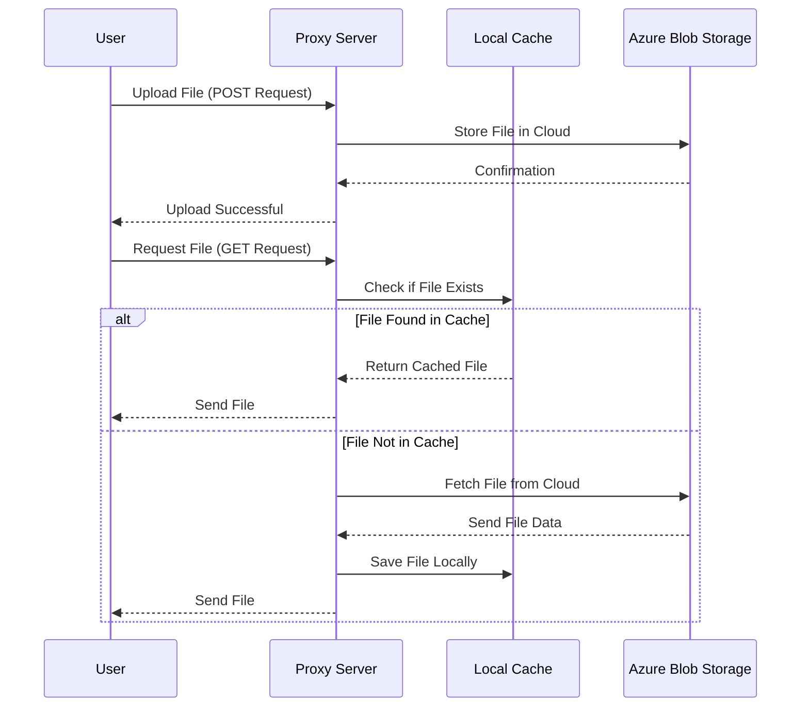

# KernelCI Storage Server

This is a simple storage server that supports file upload and download, with token based authentication.
It supports multiple backends, currently only Azure Blob is supported, to provide user transparent storage.
It caches the files in a local directory and serves them from there.
Range requests are supported, but only for start offset, end limit is not implemented yet.

## Configuration

The server is configured using toml configuration file, the default configuration file is `config.toml`.

```toml
jwt_secret="JWT_SECRET"
[azure]
account=""
key=""
container=""
sastoken=""
```

## API

### Upload

`POST /upload`

Upload a file to the server.

field path: the path to store the file in the server.
field file0: the file to upload.

### Download

`GET /path/to/file`

Download a file from the server.

### Authentication

The server uses JWT token based authentication. The token is passed in the `Authorization` header as a Bearer token.
JWT secret is configured in the `config.toml` file.

```bash
./kernelci-storage -generate_jwt_token user@email.com
```
This will generate a JWT token for the user.

#### Testing Token Validity

You can verify if a token is valid using the `/v1/checkauth` endpoint:

```bash
curl -X GET http://localhost:3000/v1/checkauth \
    -H "Authorization: Bearer <JWT_TOKEN>"
```

**Responses:**
- `200 OK` with body `Authorized: user@email.com` - Token is valid
- `401 Unauthorized` with body `Unauthorized` - Token is invalid or missing

### Testing upload and download using curl

```bash
# Upload
curl -X POST http://files.kernelci.org/upload \
    -H "Authorization: Bearer <JWT_TOKEN>" \
    -F "path=testfolder" \
    -F "file0=@local_folder/local_file"

# File will be uploaded to Azure Blob Storage as testfolder/local_folder/local_file

# Download
curl http://files.kernelci.org/testfolder/local_folder/local_file
```

## Principle of operation


