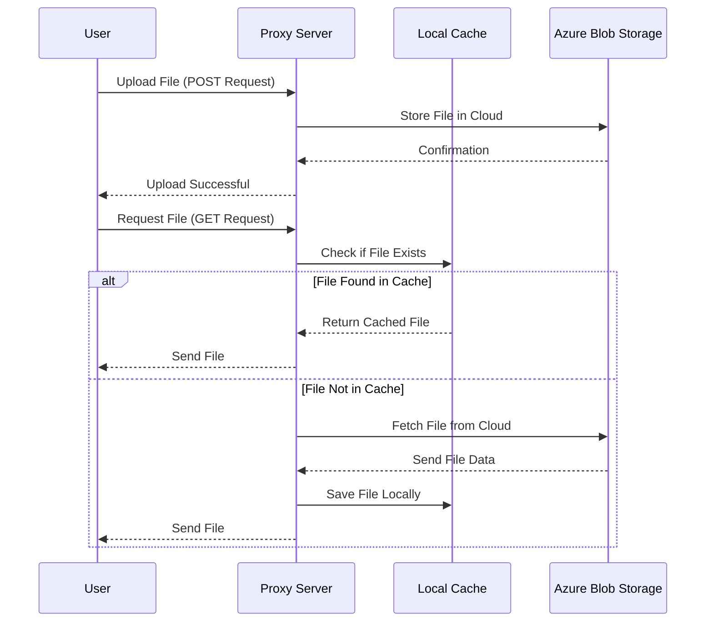

We have simple storage server that supports file upload and download, with JWT token based authentication.

## API Endpoints

The API is quite simple with upload through a `/upload` endpoint and download through a GET to the file url.

### Upload

`POST /upload`

Upload a file to the server.

field path: the path to store the file in the server.
field file0: the file to upload.

### Download

`GET /path/to/file`

Download a file from the server.

### Request a token

Ask the kernelci-sysadmin team for a token.

### Testing upload and download using curl

```bash
# Upload
curl -X POST http://files.kernelci.org/upload \
    -H "Authorization: Bearer <JWT_TOKEN>" \
    -F "path=testfolder" \
    -F "file0=@local_folder/local_file"

# File will be uploaded to Azure Blob Storage as testfolder/local_folder/local_file

# Download
curl http://files.kernelci.org/testfolder/local_folder/local_file
```

## Principle of operation


